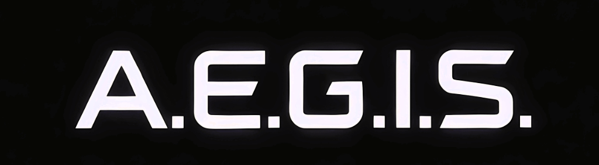
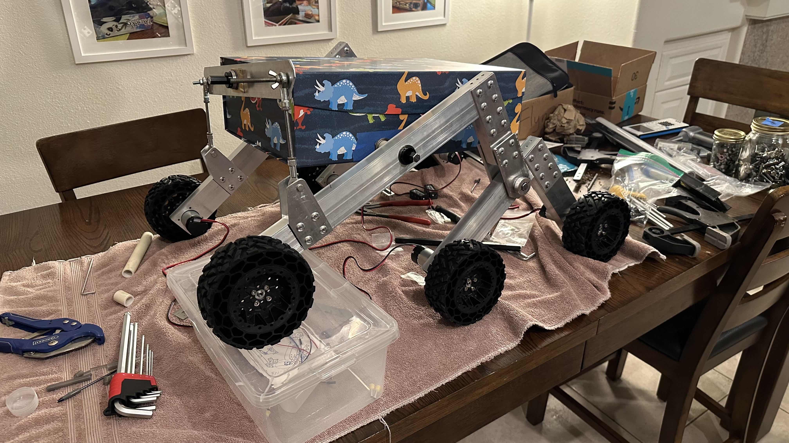
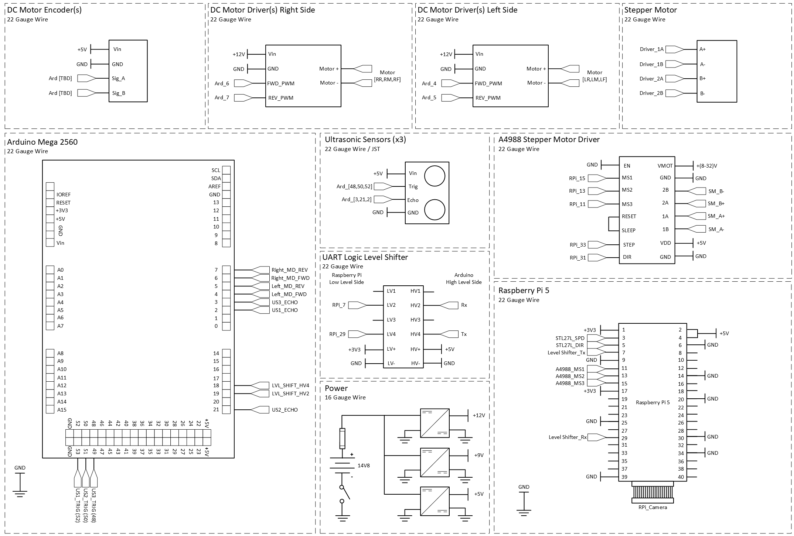
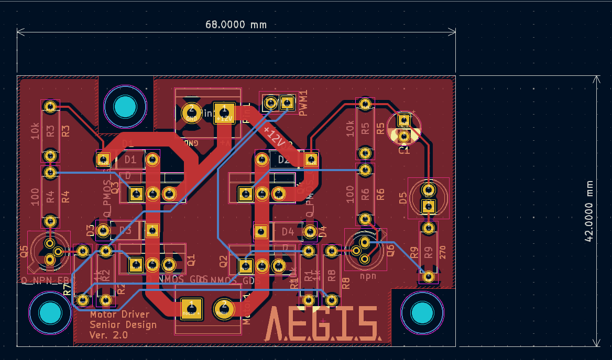
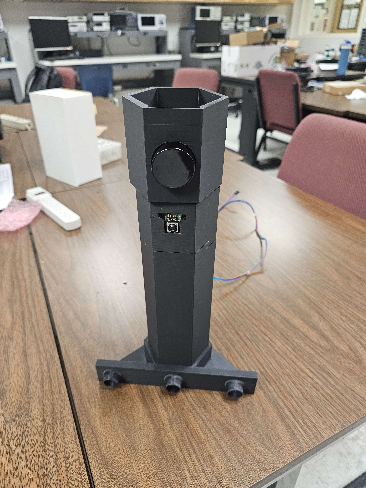

# Automated Environmental Ground Imaging System: CSUN 2025 Senior Design Project

## Overview

This is the repository for the software and documentation of the capstone project
entitled AEGIS. Capstone projects are required for all Bachelors' degree students. The team was advised by Dr. Myung Cho and had six members:

* Celeste Duran, Computer Engineer        
* Jonathan Galindo, Electrical Engineer
* Zachary Martin, Computer Engineer
* Jonathan Peña, Electrical Engineer
* Melissa Ramirez, Electrical Engineer
* Justin Terryberry, Electrical Engineer

The purpose of the project was to create a mock Mars rover capable of performing the following tasks:

1. Navigating autonomously along a predetermined path,
2. Taking high-resolution 3D scans of the environment, and
3. Merging these scans together to create a map usable by human researchers or other autonomous vehicles.

This project was created a few days after NASA released their preliminary report on the crash of the Mars Ingenuity helicopter, which at the time was believed to have impacted the ground due to an inability to distinguish ground features. This inability caused the helicopter to miscalculate its pose and position, leading to erroneous motion and its ultimate crash-landing. We set out to design a cost-effective ground scanner using a planar LiDAR unit and stepper motor that could capture a 3D map of the surface of the planet. A helicopter or other vehicle could then use the map and accelerometer data to understand where it is relative to the start of its trip.

## Detailed Description

Fill this in later.

### How to install

Fill this in later.

### How to run the code

Fill this in later.

### Dependencies

Fill this in later.

## Images

|                               |
| :---------------------------: |
|The rover was a little too excited during testing.|

|                               |
| :---------------------------: |
| The first prototype of AEGIS. |

|                               |
| :---------------------------: |
|The first full schematic diagrams of the AEGIS electrical systems.|

|                               |
| :---------------------------: |
|The second version of the handmade motor driver circuit PCB design.|

|                               |
| :---------------------------: |
|A 3D-printed prototype of the LiDAR scanner and mounting system.|

|                               |
| :---------------------------: |
|The internals of the second prototype of AEGIS.|

## Thanks

We worked hard on this project, but our success was not ours alone. We want to extend heartfelt gratitude to:
* Dr. Cho, whose technical, financial, and personal support gave us the chance to explore, test, fail, learn, and succeed in ways we didn't think were possible
* The CSUN ECE department, who worked with us to realize our vision
* The CSUN machine shop, especially Neil, who offered invaluable information regarding mechanical designs and best practices
* Mark Terryberry, for ...
* Terry Martin, for providing his wisdom, time, and effort to help us construct a more durable prototype
* Artyom Petrosyan, for his assistance in brainstorming, algorithm development, and Blender rendering
* FINISH THIS

